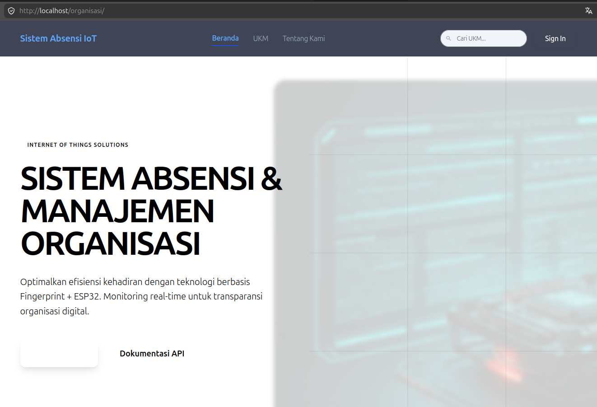

# Sistem Absensi IoT: Fingerprint & Real-time Dashboard

[](https://opensource.org/licenses/MIT)
[](https://www.php.net/)
[](https://www.espressif.com/en/products/socs/esp32)

Sistem Absensi berbasis Internet of Things (IoT) yang mengintegrasikan perangkat keras ESP32, sensor sidik jari AS608, dan dashboard web modern untuk manajemen kehadiran Unit Kegiatan Mahasiswa (UKM) atau organisasi secara efisien dan transparan.




## Deskripsi Proyek

Proyek ini dirancang untuk menggantikan sistem absensi manual dengan solusi digital yang aman dan dapat dipantau secara langsung. Dengan sinkronisasi antara perangkat keras dan aplikasi web, admin dapat mengelola data anggota, memantau kehadiran secara real-time, dan menghasilkan laporan otomatis.

## Fitur Unggulan

*   **Monitoring Real-time**: Pembaruan dashboard secara otomatis setiap kali ada aktivitas absensi dari perangkat IoT.
*   **Arsitektur Multi-UKM**: Memungkinkan manajemen banyak organisasi dalam satu platform terpusat melalui hak akses Superadmin.
*   **Keamanan Komunikasi**: Integrasi API Key dan header khusus untuk memastikan komunikasi antara ESP32 dan server tetap aman.
*   **Otentikasi Berlapis**: Dilengkapi dengan sistem login yang aman, perlindungan CSRF, dan dukungan Two-Factor Authentication (2FA).
*   **Ekspor Laporan**: Fasilitas untuk mengunduh laporan kehadiran dalam format Excel yang terstruktur.
*   **Sinkronisasi Biometrik**: Manajemen data sidik jari (Enroll, Delete, Verify) langsung melalui sinkronisasi database dan perangkat.

## Arsitektur Teknologi

### Stack Web
*   **Bahasa Pemrograman**: PHP 8.x (Vanilla dengan pola desain MVC)
*   **Database**: MySQL
*   **Frontend**: Tailwind CSS & Chart.js (Visualisasi Data)
*   **Keamanan**: API Key Authentication, CSRF Protection, 2FA

### Perangkat Keras (IoT)
*   **Mikrokontroler**: ESP32
*   **Sensor**: AS608 Optical Fingerprint Sensor
*   **Konektivitas**: WiFiManager untuk konfigurasi jaringan dinamis
*   **Firmware**: Arduino C++

## Panduan Instalasi

### 1. Konfigurasi Web Server
1. Clone repositori ini ke direktori server Anda:
   ```bash
   git clone https://github.com/bufan354/absensi-iot.git
   ```
2. Buat database baru di MySQL (contoh: `absensi_iot`).
3. Import skema database yang tersedia di `database/schema.sql`.
4. Ubah nama file `.env.example` menjadi `.env` dan sesuaikan konfigurasi database serta `API_KEY`.
5. Pastikan direktori `uploads/` memiliki izin akses tulis (write permission).

### 2. Konfigurasi Hardware (ESP32)
1. Akses direktori `hardware/ESP32_Fingerprint/` menggunakan Arduino IDE.
2. Salin `config.h.example` menjadi `config.h`.
3. Sesuaikan `SERVER_URLS` dan `API_KEY` (harus identik dengan nilai di file `.env` server).
4. Instal library pendukung berikut pada Arduino IDE:
   *   Adafruit Fingerprint Sensor Library
   *   WiFiManager
   *   LiquidCrystal_I2C
5. Lakukan proses upload kode ke modul ESP32.

## Standar Keamanan

Sistem ini menerapkan standar keamanan tinggi untuk melindungi integritas data:
*   Pemisahan data sensitif melalui variabel lingkungan (.env).
*   Validasi setiap request dari perangkat keras menggunakan header `X-API-KEY`.
*   Implementasi token CSRF pada setiap formulir administrasi.
*   Enkripsi data pada level aplikasi untuk informasi kredensial.

## Lisensi

Proyek ini dilisensikan di bawah **MIT License**. Silakan lihat file `LICENSE` untuk informasi lebih lanjut.

---
*Dikembangkan untuk solusi manajemen kehadiran organisasi dan keperluan akademik.*
